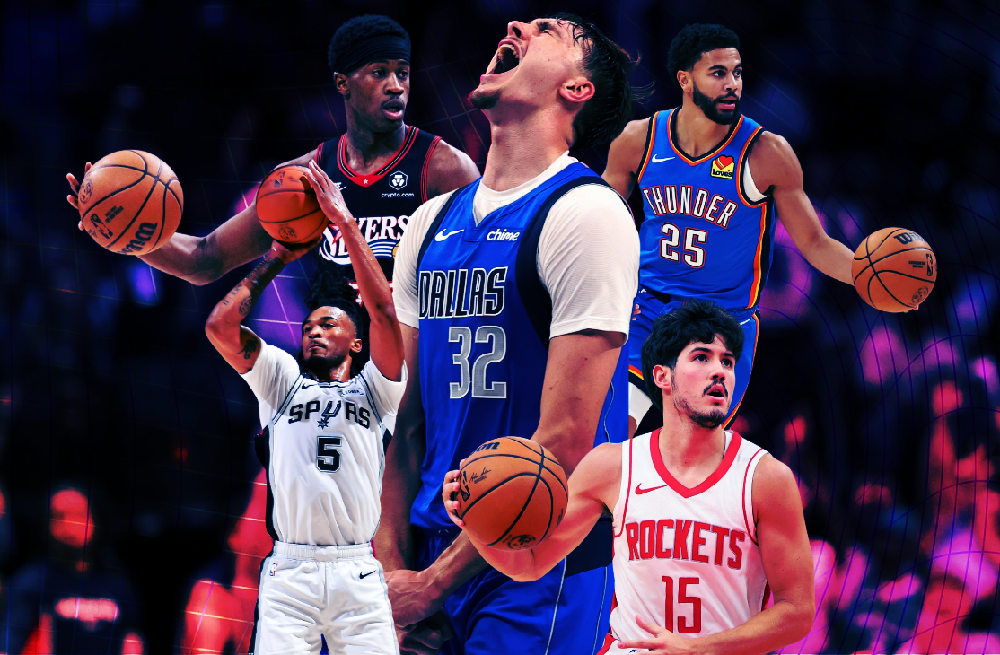

## **Is the success of an NBA player's career bound by how well their first couple of seasons go? Or do they still have time to reach their star potential?**

The goal of this project was to use machine learning to predict the careers of current NBA rookies and sophomores. To do so, I trained separate Random Forest and K-Nearest Neighbors (KNN) models on first and second year stats of all NBA players since 1990. I then used these trained models to provide the following for current rookies and sophomores:

* The percentage chance that the player will become an All-Star later in their career.
* The three most similar players to them in NBA history based on their statistical profile so far.

The hope was to see whether any players off to slow starts to their careers still have a decent chance of developing into a star.

**(Check out the full Substack write-up for this project here.)**
